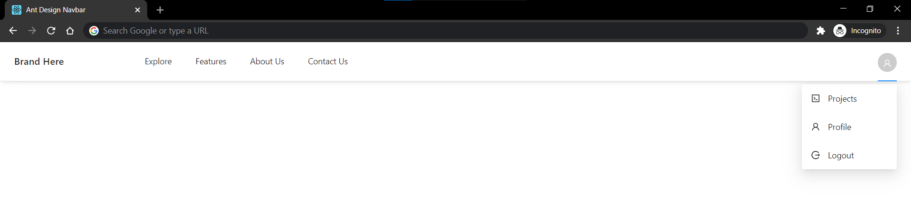
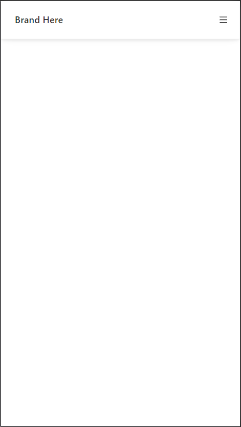
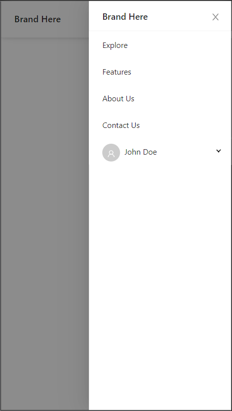

## Ant Design Navbar
A fully responsive Navbar made using [Ant Design](https://ant.design/) v4.7 and React.
This navbar is based on [ant-design-responsive-navbar](https://github.com/graphicskart/ant-design-responsive-navbar) which is made using Ant Design v3.x


## How to run this on your machine

1. [Fork](https://github.com/thisuraseniya/Ant-Design-Navbar/fork) the repository.

2. Clone the repository to your machine.

   ```bash
   $ git clone https://github.com/<username>/Ant-Design-Navbar.git
   ```

3. Install node_modules.

   ```bash
   $ npm install
   ```

4. Start the React development server.

   ```bash
   $ npm start
   ```


## PRs are welcome!

If you find any issues, please feel free to submit them [here](https://github.com/thisuraseniya/Ant-Design-Navbar/issues). Also, if you have a fix to an issue you can most certainly send a [Pull Request](https://github.com/thisuraseniya/Ant-Design-Navbar/pulls)


## Screenshots

Desktop view



Mobile View (Collapsed)



Mobile View (Expanded)




